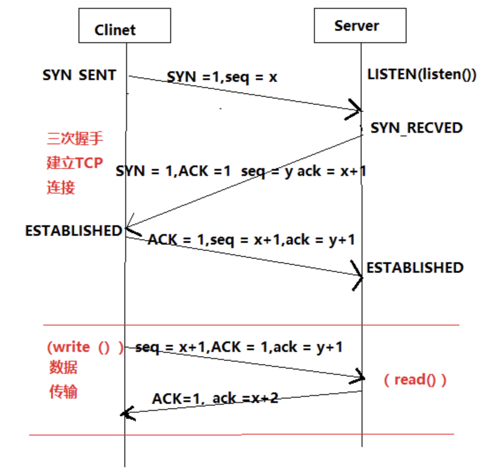
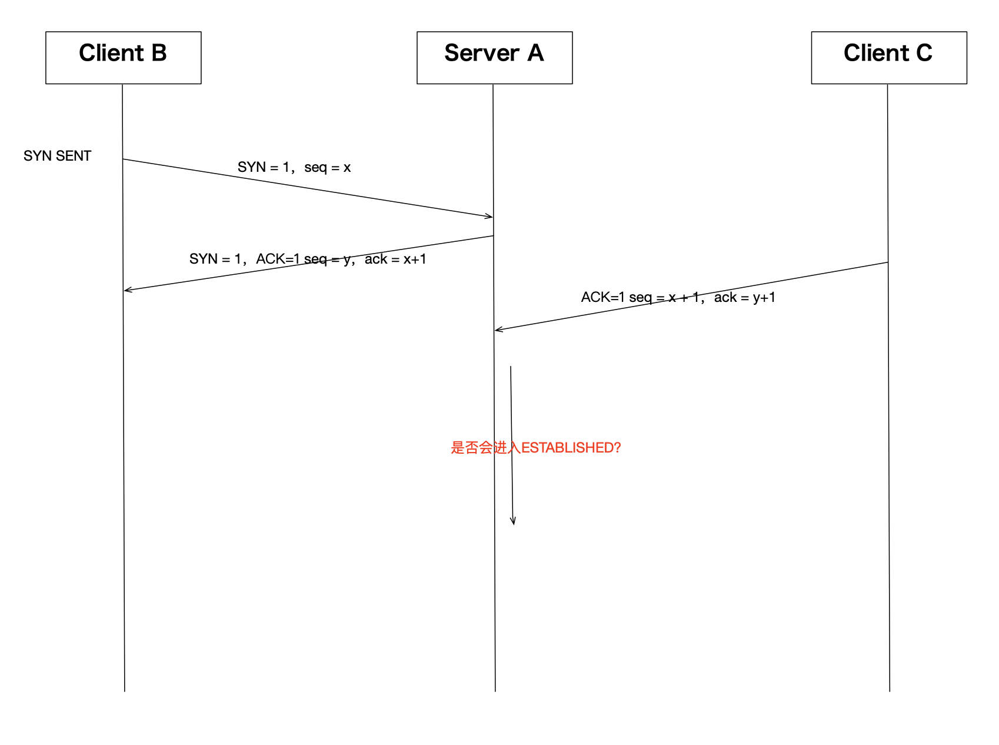
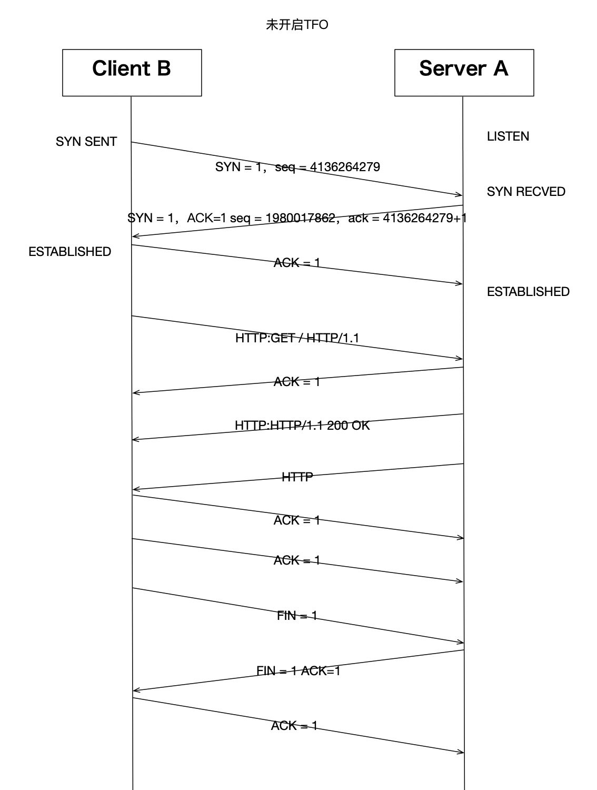
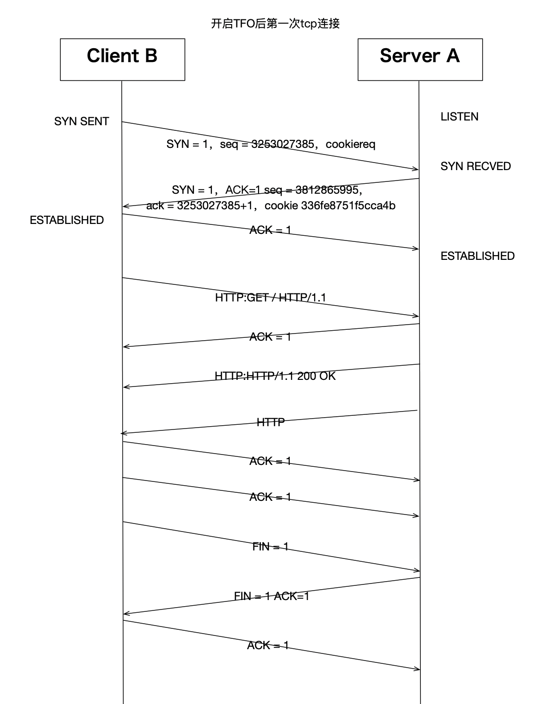
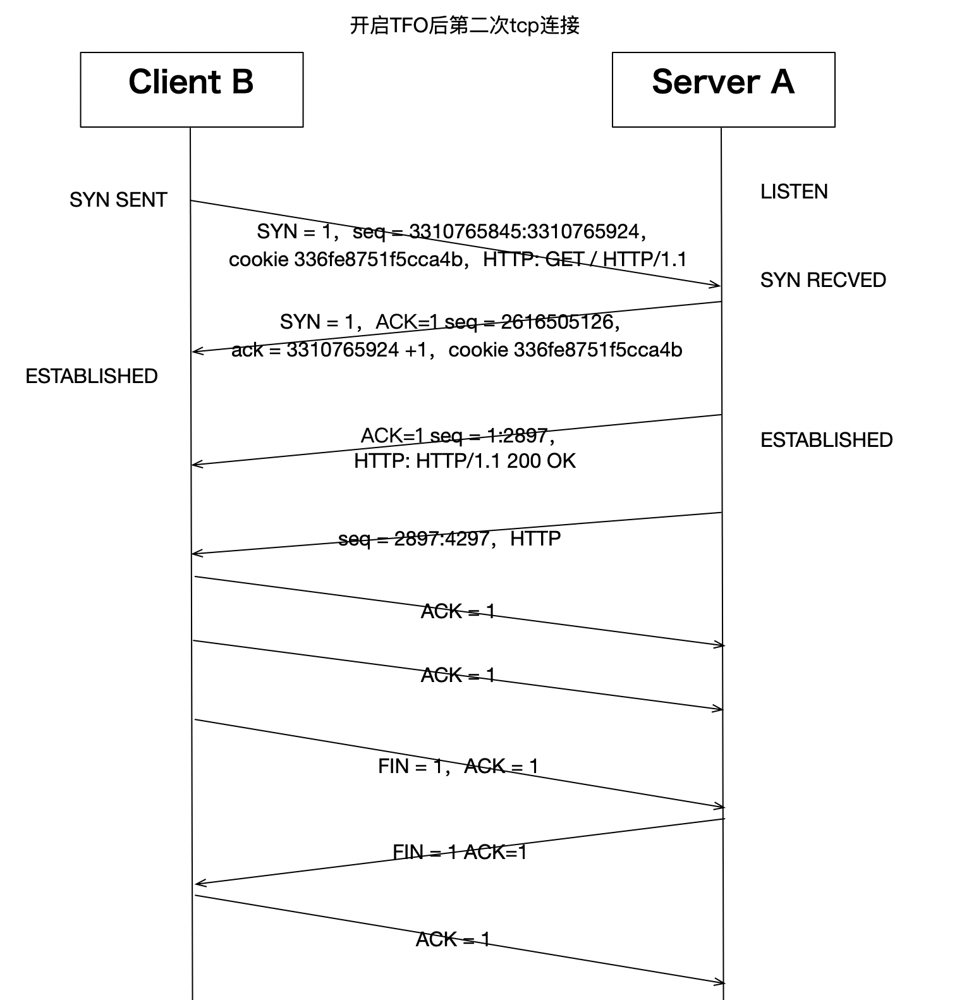

# Linux的TCP实现之：三次握手

-------------------------------------------------------------------------------------

版权声明：

本文章内容在非商业使用前提下可无需授权任意转载、发布。

转载、发布请务必注明作者和其微博、微信公众号地址，以便读者询问问题和甄误反馈，共同进步。

微博：
[https://weibo.com/orroz/](https://weibo.com/orroz)

博客：
[https://zorrozou.github.io/](https://zorrozou.github.io/)

微信公众号：**Linux系统技术**

-------------------------------------------------------------------------------------


## 前言

TCP协议是一个大家好像都熟悉，又好像都不熟悉的协议。说熟悉，是因为我们基本每天都要用到它，所有人似乎对三次握手、四次挥手、滑动窗口、慢启动、拥塞避免、拥塞控制等概念好像都有些了解。说不熟悉，是因为TCP协议相当的复杂，而且在运行过程中网络环境会变化，TCP的相关机制也会因为不同的变化而产生相关的适应行为，真的要说清楚其相关概念和运行过程又真的很不容易。

本系列文章希望从另一个角度交代清楚Linux上TCP实现的部分细节，当然能力有限，有些交代不清楚的地方还希望大家海涵。本文就从TCP建立连接的三次握手开始，希望对你有所帮助。本文内核代码版本基于linux-5.3。

## 什么是可靠和面向连接？

说到TCP，不可不说的就是其是一个面向连接和可靠的传输层协议。相对的就是UDP，不可靠且非面向连接。其实IP的交付就是面向无连接和不可靠的协议，而UDP只是简单的在IP层协议上加了个传输层的端口封装，所以自然继承了IP的交付质量。TCP之所以复杂，就是因为它的设计需要在一个面向无连接、不可靠的IP上实现一个面向连接、可靠的传输层协议。所以，我们需要先从工程角度理解清楚到底什么是面向连接？什么是可靠？才能理解TCP为啥要这么复杂。

我们先来概述一下这几个问题：

什么是面向连接：

连接：在一个连接中传输的数据是有关系状态的，比如需要确定传输的对端正处在等待发送或接收的状态上。需要维护传输数据的关系，比如数据流的顺序。典型的例子就是打电话。

无连接：不用关心对端是否在线。每一个数据段的发送都是独立的一个数据个体，数据和数据之间没有关系，无需维护其之间的关系。典型的例子就是发短信。

什么是可靠：

主要是指数据在传输过程中不会被损坏或者丢失，保证数据可以正确到达。而不做以上保证的就是不可靠。

如何解决面向连接问题：

使用建立连接，传输数据，断开连接的三步创建一个长期的数据传输机制，在同一个连接中的数据传输是有上下文关系的。所以就要引申出以下概念：

需要维护seq序列号字段维护数据的顺序关系保证按序交付，和解决数据包重复的问题。

需要部分特殊的状态标记的包来专门创建、断开和维护一个连接：syn，ack，fin，rst

如何解决可靠性问题：

引入数据传输的确认机制，即数据发送之后等待对方确认。于是需要维护确认字段Acknowledgement和ack状态。即：停止等待协议。

引入数据确认机制（停止等待协议）之后，引发了带宽利用律不高的问题，如何解决？解决方案是引入窗口确认机制和滑动窗口，即不在以每个包发送之后进行确认，而是发送多个包之后一起确认。

引入窗口之后，如何在不同延时的网络上选择不同窗口大小？解决方法是引入窗口变量，和窗口监测通告：

发送方维护：

已发送并确认ack偏移量（窗口左边界）

已发送未确认ack偏移量（窗口当前发送字节位置）

即将发送偏移量（窗口右边界）

接收方维护：

已接受并确认偏移量（窗口左边界）

接受后会保存的窗口大小（窗口右边界）

接收方会给发送方回复ack确认，ack中会有最新窗口通告长度，以便发送方调整窗口长度。此处会引入sack选择确认行为和窗口为0时的坚持定时器行为。

引入滑动窗口之后，带宽可以充分被利用了，但是网络环境是复杂的，随时可能因为大量的数据传输导致网络上的拥塞。于是要引入拥塞控制机制：当出现拥塞的时候，tcp应该能保证带宽是被每条tcp连接公平分享的。所以在拥塞的情况下，要能将占用带宽较大的连接调整为占用带宽变小，占用小的调大。以达到公平占用资源的目的。

拥塞控制对带宽占用的调整本质上就是调整滑动窗口的大小来实现的，所以需要在接受端引入一个新的变量叫做cwnd：拥塞窗口，来反应当前网络的传输能力，而之前的通告窗口可以表示为awnd。此时发送端实际可用的窗口为cwnd和awnd的较小者。

由此引发的各种问题和概念不一而足，比如：如何决定实际的通告窗口大小？慢启动是什么？拥塞避免过程如何工作？拥塞控制是怎么作用的？等等等等......

TCP之所以复杂，根本原因就是要在工程上解决这些问题。思路概述完了，我们先来看三次握手到底是干嘛的。

## 为什么要三次？

为什么要三次握手，而不是两次，或者四次？或者其他次数？

首先我们要先理解建立连接的目的，有两个：

1、确认对端在线，即我请求你的时候你能立即给出响应。（面向连接）

2、如果传输的数据多的话，要保证包的顺序，所以要确认这个链接中传输数据的起始序列号。因为数据是双向传输的，所以两边都要确认对端的序列号。

确认了第二个目的之后，我们就能理解，两次握手至少让一段无法确定对端是否了解了你的起始序列号。即，假设我是服务端。对端syn给我发了序列号，我也给对端回了我的序列号，但是如果我给对方发的这个数据包丢了怎么办？于是我没法确认对端是否收到，所以需要对端再跟我确认一下他确实收到了。

那么非要四次的话也不是不行，只是太啰嗦了，所以三次是最合理的。不能免俗，我们还是用这个经典的图来看一下三次握手的过程。



我面试别人的时候经常会在这里问一个比较弱智的问题：如果服务端A，在收到客户端B发来的syn之后，并且回复了syn+ack之后，收到了从另一个客户端C发来的ack包，请问此时服务端A会跟C建立后续的ESTABLISHED连接吗？

画成图的话是这样：



这个问题之所以说是比较弱智，是因为大多数人都觉得不会，但是如果再追问为什么的话，又很少人能真正答出来。那么为什么呢？其实也很简单，一个新的客户端的ip+port都不一样，直接给我发一个ack的话，根据tcp协议会直接回复rst，自然不会创建连接。这里其实引申出一个问题，内核在这里要能识别出给我发这个ack请求的到底是第一次给我发的，还是之前有发过syn并且我已经回复了syn+ack的。内核会通过四元组进行查询，这个查询会在tcp_v4_rcv()中执行，就是tcp处理的总人口，其中调用__inet_lookup()进行查找。

```
static inline struct sock *__inet_lookup(struct net *net,
                                         struct inet_hashinfo *hashinfo,
                                         struct sk_buff *skb, int doff,
                                         const __be32 saddr, const __be16 sport,
                                         const __be32 daddr, const __be16 dport,
                                         const int dif, const int sdif,
                                         bool *refcounted)
{
        u16 hnum = ntohs(dport);
        struct sock *sk;

        sk = __inet_lookup_established(net, hashinfo, saddr, sport,
                                       daddr, hnum, dif, sdif);
        *refcounted = true;
        if (sk)
                return sk;
        *refcounted = false;
        return __inet_lookup_listener(net, hashinfo, skb, doff, saddr,
                                      sport, daddr, hnum, dif, sdif);
}
```

查找分两步，先检查established中是否有连接，再检查linstener中是否有连接，如果没有就直接send_reset。确认连接存在后，如果是TCP_ESTABLISHED状态，直接tcp_rcv_established()接收数据，否则进入tcp_rcv_state_process()处理tcp的各种状态。如果是第一次握手，就是TCP_LISTEN状态，进入：

acceptable = icsk->icsk_af_ops->conn_request(sk, skb) >= 0;

此时conn_request为tcp_v4_conn_request()，在这个方法中进行第一次握手的处理。如果是第三次握手，此时tcp状态应为：TCP_SYN_RECV。

服务端在SYN RECVED的状态下，要在缓存中纪录客户端syn包中的内容，以便在收包的过程中进行查找，占用部分slab缓存。这个缓存在内核中有个上限，用/proc/sys/net/ipv4/tcp_max_syn_backlog来限制缓存的个数。这个值决定了tcp再正常状态下可以同时维持多少个TCP_SYN_RECV状态的连接，即服务端半连接个数。一般服务器上的这个值默认为1024-2048，这个值默认情况会根据你的总内存大小自动产生，内存大的值会大一些。

如果这个半连接队列被耗尽了会怎么样？我们依然可以在内核中找到答案，在tcp_conn_request()中可以看到这样一段：

```
        if (!want_cookie && !isn) {
                /* Kill the following clause, if you dislike this way. */
                if (!net->ipv4.sysctl_tcp_syncookies &&
                    (net->ipv4.sysctl_max_syn_backlog - inet_csk_reqsk_queue_len(sk) <
                     (net->ipv4.sysctl_max_syn_backlog >> 2)) &&
                    !tcp_peer_is_proven(req, dst)) {
                        /* Without syncookies last quarter of
                         * backlog is filled with destinations,
                         * proven to be alive.
                         * It means that we continue to communicate
                         * to destinations, already remembered
                         * to the moment of synflood.
                         */
                        pr_drop_req(req, ntohs(tcp_hdr(skb)->source),
                                    rsk_ops->family);
                        goto drop_and_release;
                }

                isn = af_ops->init_seq(skb);
        }
```

 这里相关几个概念：

1、syncookie是什么？

2、inet_csk_reqsk_queue_len(sk)是什么？

我们后面会详细说syncookie机制，这里先知道这样一个结论即可：当syncookie开启的情况下，半连接队列可认为无上限。从inet_csk_reqsk_queue_len的定义可以知道其查看的是request_sock_queue结构体中的qlen。结构体定义如下：

```
/*
 * For a TCP Fast Open listener -
 *      lock - protects the access to all the reqsk, which is co-owned by
 *              the listener and the child socket.
 *      qlen - pending TFO requests (still in TCP_SYN_RECV).
 *      max_qlen - max TFO reqs allowed before TFO is disabled.
 *
 *      XXX (TFO) - ideally these fields can be made as part of "listen_sock"
 *      structure above. But there is some implementation difficulty due to
 *      listen_sock being part of request_sock_queue hence will be freed when
 *      a listener is stopped. But TFO related fields may continue to be
 *      accessed even after a listener is closed, until its sk_refcnt drops
 *      to 0 implying no more outstanding TFO reqs. One solution is to keep
 *      listen_opt around until sk_refcnt drops to 0. But there is some other
 *      complexity that needs to be resolved. E.g., a listener can be disabled
 *      temporarily through shutdown()->tcp_disconnect(), and re-enabled later.
 */
struct fastopen_queue {
        struct request_sock     *rskq_rst_head; /* Keep track of past TFO */
        struct request_sock     *rskq_rst_tail; /* requests that caused RST.
                                                 * This is part of the defense
                                                 * against spoofing attack.
                                                 */
        spinlock_t      lock;
        int             qlen;           /* # of pending (TCP_SYN_RECV) reqs */
        int             max_qlen;       /* != 0 iff TFO is currently enabled */

        struct tcp_fastopen_context __rcu *ctx; /* cipher context for cookie */
};

/** struct request_sock_queue - queue of request_socks
 *
 * @rskq_accept_head - FIFO head of established children
 * @rskq_accept_tail - FIFO tail of established children
 * @rskq_defer_accept - User waits for some data after accept()
 *
 */
struct request_sock_queue {
        spinlock_t              rskq_lock;
        u8                      rskq_defer_accept;

        u32                     synflood_warned;
        atomic_t                qlen;
        atomic_t                young;

        struct request_sock     *rskq_accept_head;
        struct request_sock     *rskq_accept_tail;
        struct fastopen_queue   fastopenq;  /* Check max_qlen != 0 to determine
                                             * if TFO is enabled.
                                             */
};
```

这里又引申出一个新概念：TFO - TCP Fast Open，这里我们依旧先略过，放到后面讲。这个结构体中的qlen会在tcp_conn_request()函数执行结束后增加：

```
        if (fastopen_sk) {
                af_ops->send_synack(fastopen_sk, dst, &fl, req,
                                    &foc, TCP_SYNACK_FASTOPEN);
                /* Add the child socket directly into the accept queue */
                if (!inet_csk_reqsk_queue_add(sk, req, fastopen_sk)) {
                        reqsk_fastopen_remove(fastopen_sk, req, false);
                        bh_unlock_sock(fastopen_sk);
                        sock_put(fastopen_sk);
                        goto drop_and_free;
                }
                sk->sk_data_ready(sk);
                bh_unlock_sock(fastopen_sk);
                sock_put(fastopen_sk);
        } else {
                tcp_rsk(req)->tfo_listener = false;
                if (!want_cookie)
                        inet_csk_reqsk_queue_hash_add(sk, req,
                                tcp_timeout_init((struct sock *)req));
                af_ops->send_synack(sk, dst, &fl, req, &foc,
                                    !want_cookie ? TCP_SYNACK_NORMAL :
                                                   TCP_SYNACK_COOKIE);
                if (want_cookie) {
                        reqsk_free(req);
                        return 0;
                }
        }
```

可以理解为，qlen为服务端listen端口的半连接队列当前长度。于是这一段可以理解为：

```
if (!net->ipv4.sysctl_tcp_syncookies &&
                    (net->ipv4.sysctl_max_syn_backlog - inet_csk_reqsk_queue_len(sk) <
                     (net->ipv4.sysctl_max_syn_backlog >> 2)) &&
                    !tcp_peer_is_proven(req, dst)) {
```

当没开启syncookie时，如果当前半连接池剩余长度小于最大长度的四分之一后，就不再处理新建连接请求了。这也就是著名的synflood攻击的原理：

针对一个没有syncookie功能的服务器，任意客户端都可以通过构造一个不完整三次握手过程，只发syn，不回第三次握手的ack来占满服务端的半连接池，导致服务端无法再跟任何客户端进行tcp新建连接。

那么我们也就知道syncookie这个功能的设计初衷了：防止synflood。

## syncookie如何防止synflood？

既然已经明确synflood是针对半连接池上限的攻击，那么我们就需要想办法绕过去半连接池。能否让服务器端不纪录第一个syn发来的四元组信息，还能再第三次握手的时候做验证呢？其实也是可能的：既然三次握手的第二次是服务端回包，那为什么不把第一次握手得到的信息放到回包里，让客户端在第三次握手的时候再把这个信息带回来，然后我们拿到第三次握手的四元组信息和其中记录的信息做验证不就好了？当然，为了包内容尽量小，我们把需要记录到包里的信息做一下hash运算，运算出来的新数据就叫cookie。

具体处理方法描述如下：

在tcp_conn_request()中调用以下代码产生cookie:

```
        if (want_cookie) {
                isn = cookie_init_sequence(af_ops, sk, skb, &req->mss);
                req->cookie_ts = tmp_opt.tstamp_ok;
                if (!tmp_opt.tstamp_ok)
                        inet_rsk(req)->ecn_ok = 0;
        }
```

追溯到实际产生cookie的方法为：

```
static __u32 secure_tcp_syn_cookie(__be32 saddr, __be32 daddr, __be16 sport,
                                   __be16 dport, __u32 sseq, __u32 data)
{
        /*
         * Compute the secure sequence number.
         * The output should be:
         *   HASH(sec1,saddr,sport,daddr,dport,sec1) + sseq + (count * 2^24)
         *      + (HASH(sec2,saddr,sport,daddr,dport,count,sec2) % 2^24).
         * Where sseq is their sequence number and count increases every
         * minute by 1.
         * As an extra hack, we add a small "data" value that encodes the
         * MSS into the second hash value.
         */
        u32 count = tcp_cookie_time();
        return (cookie_hash(saddr, daddr, sport, dport, 0, 0) +
                sseq + (count << COOKIEBITS) +
                ((cookie_hash(saddr, daddr, sport, dport, count, 1) + data)
                 & COOKIEMASK));
}
```

根据包的四元组信息和当前时间算出hash值，并记录在isn中。发送synack使用tcp_v4_send_synack()函数，其中调用tcp_make_synack()，判断cookie_ts是不是被设置，如果被设置则初始化tcp选项信息到timestamp中的低6位。

```
#ifdef CONFIG_SYN_COOKIES
        if (unlikely(req->cookie_ts))
                skb->skb_mstamp_ns = cookie_init_timestamp(req);
        else
#endif
```

这样把synack发回给客户端，包中包含了cookie信息。客户端在回复最后一个ack时将seq+1，就是说服务端收到最后一个ack的时候，只要将ack的seq序列号-1，就能拿到之前送出去的cookie。然后再根据包的四元组信息算一遍cookie，验证算出来的cookie和返回的cookie是不是一样就行了。具体方法在cookie_v4_check()中，有兴趣可以自行检索代码。

经过这样的验证，将原来需要内存资源进行处理的过程，完全转变成了CPU运算，这样即使有synflood攻击，攻击的也不再是内存上限，而是会转换成CPU运算，这样会使攻击的效果大大减弱。

syncookie功能内核默认是打开的，开关在：

/proc/sys/net/ipv4/tcp_syncookies

这个文件默认值为1，代表打开syncookie功能。要注意的是，这种场景下，只有在tcp_max_syn_backlog上限被耗尽之后，新建的连接才会使用syncookie。设置0为关闭syncookie，设置为2为忽略tcp_max_syn_backlog半连接队列，直接使用syncookie。

## listen backlog

这里还要额外说明一下的是listen系统调用的backlog参数。我们都知道，要让一个端口处在监听状态，需要调用socket、bind、listen三个系统调用，而最终TCP进入LISTEN状态，就是由listen系统调用来做的。这个系统调用的第二个参数backlog在man page中解释如下：

```
The  backlog argument defines the maximum length to which the queue of pending connections for sockfd may grow.  If a connection request arrives when the  queue  is  full,  the  client  may receive  an  error  with an indication of ECONNREFUSED or, if the underlying protocol supports retransmission, the request may be ignored so that a later reattempt at connection succeeds.
```

从描述上看，这个backlog似乎限制了tcp的半连接队列，但是如果你看man page可以细心一点，再往下翻翻，就可以看到这段内容：

```
NOTES
       To accept connections, the following steps are performed:

           1.  A socket is created with socket(2).

           2.  The socket is bound to a local address using bind(2), so that  other  sockets  may  be  connect(2)ed to it.

           3.  A  willingness  to  accept incoming connections and a queue limit for incoming connections are specified with listen().

           4.  Connections are accepted with accept(2).

       POSIX.1-2001 does not require the inclusion of <sys/types.h>, and  this  header  file  is  not required  on Linux.  However, some historical (BSD) implementations required this header file, and portable applications are probably wise to include it.

       The behavior of the backlog argument on TCP sockets changed with Linux 2.2.  Now it  specifies the  queue  length  for  completely established sockets waiting to be accepted, instead of the number of incomplete connection requests.  The maximum length  of  the  queue  for  incomplete sockets  can be set using /proc/sys/net/ipv4/tcp_max_syn_backlog.  When syncookies are enabled there is no logical maximum length and this setting is ignored.  See tcp(7) for more  information.

       If  the backlog argument is greater than the value in /proc/sys/net/core/somaxconn, then it is silently truncated to that value; the default value in this file is 128.   In  kernels  before 2.4.25, this limit was a hard coded value, SOMAXCONN, with the value 128.
```

这段内容真正解释了这个backlog的真实含义。简单来说就是，一个tcp连接的建立主要包括4部：

1、创建一个socket。socket()

2、将socket和本地某个地址和端口绑定。bind()

3、将socket值为listen状态。listen()

此时，客户端就可以跟对应端口的socket创建连接了，当然这里如果创建连接的话，主要是可以完成三次握手。而还不能创建一个应用可读写的连接。最终要创建一个真正可用的连接还需要第四部：

4、服务端accept一个新建连接，并建立一个新的accept返回的fd。accept()

这之后，服务端才可以用这个新的accept fd跟客户端进行通信。而这里的listen backlog，限制的就是，如果服务端处在LISTEN状态，并且有客户端跟我建立连接，但是如果服务端没有及时accept新建连接的话，那么这种还未accpet的请求队列是多大？这里还有个问题，当这个连接队列超限之后，是什么效果？

我们可以写一个简单的服务端程序来测试一下这个状态，server端代码如下：

```
[root@localhost basic]# cat server.c
#include <stdio.h>
#include <stdlib.h>
#include <sys/types.h>
#include <sys/socket.h>
#include <arpa/inet.h>
#include <string.h>

int main()
{
	int sfd, afd;
	socklen_t socklen;
	struct sockaddr_in saddr, caddr;

	sfd = socket(AF_INET, SOCK_STREAM, 0);
	if (sfd < 0) {
		perror("socket()");
		exit(1);
	}

	bzero(&saddr, sizeof(saddr));
	saddr.sin_family = AF_INET;
	saddr.sin_port = htons(8888);
	if (inet_pton(AF_INET, "0.0.0.0", &saddr.sin_addr) <= 0) {
		perror("inet_pton()");
		exit(1);
	}
	//saddr.sin_addr.s_addr = htonl(INADDR_LOOPBACK);

	if (bind(sfd, (struct sockaddr *)&saddr, sizeof(saddr)) < 0) {
		perror("bind()");
		exit(1);
	}

	if (listen(sfd, 5) < 0) {
		perror("listen()");
		exit(1);
	}


	pause();
	while (1) {
		bzero(&caddr, sizeof(caddr));
		afd = accept(sfd, (struct sockaddr *)&caddr, &socklen);
		if (afd < 0) {
			perror("accept()");
			exit(1);
		}

		if (write(afd, "hello", strlen("hello")) < 0) {
			perror("write()");
			exit(1);
		}

		close(afd);
	}

	exit(0);
}
```

代码很简单，socket、bind、listen之后直接pause，我们来看看当前状态：

```
[root@localhost basic]# ./server &
[1] 14141
[root@localhost basic]# ss -tnal
State       Recv-Q       Send-Q               Local Address:Port                Peer Address:Port
LISTEN      0            5                          0.0.0.0:8888                     0.0.0.0:*
```

此时，对于ss命令显示的LISTEN状态连接，Send-Q数字的含义就是listen backlog的长度。我们使用telnet作为客户端连接当前8888端口，并抓包看TCP的连接过程和其变化。

```
[root@localhost basic]# tcpdump -i ens33 -nn port 8888
tcpdump: verbose output suppressed, use -v or -vv for full protocol decode
listening on ens33, link-type EN10MB (Ethernet), capture size 262144 bytes
10:54:41.863704 IP 192.168.247.130.45790 > 192.168.247.129.8888: Flags [S], seq 3982567931, win 64240, options [mss 1460,sackOK,TS val 1977602046 ecr 0,nop,wscale 7], length 0
10:54:41.863788 IP 192.168.247.129.8888 > 192.168.247.130.45790: Flags [S.], seq 3708893655, ack 3982567932, win 28960, options [mss 1460,sackOK,TS val 763077058 ecr 1977602046,nop,wscale 7], length 0
10:54:41.864005 IP 192.168.247.130.45790 > 192.168.247.129.8888: Flags [.], ack 1, win 502, options [nop,nop,TS val 1977602046 ecr 763077058], length 0
```

三次握手建立没问题。

```
[root@localhost zorro]# ss -antl
State       Recv-Q       Send-Q               Local Address:Port                Peer Address:Port
LISTEN      1            5                          0.0.0.0:8888                     0.0.0.0:*
```

ss显示可知，LISTEN状态的Recv-Q就是当前在backlog队列里排队的连接个数，我们多创建几个看超限会如何：

```
[root@localhost zorro]# ss -antl
State       Recv-Q       Send-Q               Local Address:Port                Peer Address:Port
LISTEN      6            5                          0.0.0.0:8888                     0.0.0.0:*
```

```
[root@localhost basic]# tcpdump -i ens33 -nn port 8888
tcpdump: verbose output suppressed, use -v or -vv for full protocol decode
listening on ens33, link-type EN10MB (Ethernet), capture size 262144 bytes
11:00:40.674176 IP 192.168.247.130.45804 > 192.168.247.129.8888: Flags [S], seq 3183080621, win 64240, options [mss 1460,sackOK,TS val 1977960856 ecr 0,nop,wscale 7], length 0
11:00:41.682431 IP 192.168.247.130.45804 > 192.168.247.129.8888: Flags [S], seq 3183080621, win 64240, options [mss 1460,sackOK,TS val 1977961864 ecr 0,nop,wscale 7], length 0
11:00:43.728894 IP 192.168.247.130.45804 > 192.168.247.129.8888: Flags [S], seq 3183080621, win 64240, options [mss 1460,sackOK,TS val 1977963911 ecr 0,nop,wscale 7], length 0
11:00:47.761967 IP 192.168.247.130.45804 > 192.168.247.129.8888: Flags [S], seq 3183080621, win 64240, options [mss 1460,sackOK,TS val 1977967944 ecr 0,nop,wscale 7], length 0
11:00:56.017547 IP 192.168.247.130.45804 > 192.168.247.129.8888: Flags [S], seq 3183080621, win 64240, options [mss 1460,sackOK,TS val 1977976199 ecr 0,nop,wscale 7], length 0
11:01:12.402559 IP 192.168.247.130.45804 > 192.168.247.129.8888: Flags [S], seq 3183080621, win 64240, options [mss 1460,sackOK,TS val 1977992584 ecr 0,nop,wscale 7], length 0
11:01:44.657797 IP 192.168.247.130.45804 > 192.168.247.129.8888: Flags [S], seq 3183080621, win 64240, options [mss 1460,sackOK,TS val 1978024840 ecr 0,nop,wscale 7], length 0
```

当连接个数超过6再创建新的连接后，新连接已经无法完成三次握手了，client的syn没有收到回应，开始重试，重试6次结束连接。客户端报错为：

```
[root@localhost zorro]# telnet 192.168.247.129 8888
Trying 192.168.247.129...
telnet: connect to address 192.168.247.129: Connection timed out
```

第一次握手的syn没有收到回应的情况下重试次数收到这个内核参数限制：

/proc/sys/net/ipv4/tcp_syn_retries

设置第一次握手syn在没有收到synack的情况下，最大重试次数，默认为6次。可以修改这个值达到改变重试次数的目的。但是时间规则无法改变。间隔时间是按照2的指数增长的，就是说第一次重试是1秒，第二次为2秒，然后是4秒，8秒以此类推。所以默认情况下tcp_syn_retries最多等待63秒。另外还有一个文件用来规定第二次握手的重试次数：

/proc/sys/net/ipv4/tcp_synack_retries

设置第二次握手synack发出之后，在没有收到最后一个ack的情况下，最大重试次数，默认值为5。所以tcp_synack_retries最多等待31秒。

根据以上测试我们发现，当listen backlog队列被耗尽之后，新建连接是不能完成三次握手的，这有时候会跟synflood攻击产生混淆，因为这跟synflood导致的效果类似。在内核中的tcp_conn_request()处理过程中我们可以看到内核应对synflood和listen backlog满的分别应对方法：

```
int tcp_conn_request(struct request_sock_ops *rsk_ops,
                     const struct tcp_request_sock_ops *af_ops,
                     struct sock *sk, struct sk_buff *skb)
{
        struct tcp_fastopen_cookie foc = { .len = -1 };
        __u32 isn = TCP_SKB_CB(skb)->tcp_tw_isn;
        struct tcp_options_received tmp_opt;
        struct tcp_sock *tp = tcp_sk(sk);
        struct net *net = sock_net(sk);
        struct sock *fastopen_sk = NULL;
        struct request_sock *req;
        bool want_cookie = false;
        struct dst_entry *dst;
        struct flowi fl;

        /* TW buckets are converted to open requests without
         * limitations, they conserve resources and peer is
         * evidently real one.
         */
        if ((net->ipv4.sysctl_tcp_syncookies == 2 ||
             inet_csk_reqsk_queue_is_full(sk)) && !isn) {
                want_cookie = tcp_syn_flood_action(sk, skb, rsk_ops->slab_name);
                if (!want_cookie)
                        goto drop;
        }

        if (sk_acceptq_is_full(sk)) {
                NET_INC_STATS(sock_net(sk), LINUX_MIB_LISTENOVERFLOWS);
                goto drop;
        }
......
```

当sk_acceptq_is_full(sk)时直接drop，并且会增加LINUX_MIB_LISTENOVERFLOWS对应的计数器。查询计数器对应关系我们可知，LINUX_MIB_LISTENOVERFLOWS对应的是：

SNMP_MIB_ITEM("ListenOverflows", LINUX_MIB_LISTENOVERFLOWS)

也就是/proc/net/netstat中的ListenOverflows计数。这个计数也对应netstat -s中显示的listen queue of a socket overflowed。从sk_acceptq_is_full的代码中我们可以看到，为什么listen backlog设置为5时，必须连接数超过5+1才会连接超时，因为当前连接个数必须大于最大上限：

```
static inline bool sk_acceptq_is_full(const struct sock *sk)
{
        return sk->sk_ack_backlog > sk->sk_max_ack_backlog;
}
```

从listen的man page中我们可以知道，listen backlog的内核限制文件为：

/proc/sys/net/core/somaxconn

针对某个listen socket，当前生效的配置是somaxconn和backlog的最小值。

在一般情况下，这个值是不用做优化的。我们可以想象一下什么时候我们的应用程序会在连接建立的时候来不及accept？大多数情况是当你系统负载压力特别大，以至于来不及处理新建连接的accept时，这种情况下更重要的应该去扩容了，而非增加这个队列。在这种情况下，有时甚至我们应该调小这个队列，并把客户端的syn重试次数减少，以便能够让客户端更快速的失败，防止连接积累过多导致雪崩。当然，部分并发处理架构设计不好的软件也会在非负载压力大的时候耗尽这个队列，这时候主要该调整的是软件架构或其他设置。

## TFO - TCP Fast Open

从上面代码中我们可以知道，当前Linux TCP协议栈是支持TFO的。TFO，中文名字叫TCP快速打开。顾名思义，其主要目的就是简化三次握手的过程，让TCP在大延时网络上打开速度更快。那么TFO是如何工作的呢？我们可以先从一个实际的例子来观察TFO的行为。

我们在一台服务器上开启web服务，另一台服务器使用curl访问web服务器的80端口之后访问其/页面后退出，抓到的包内容如下：

```
[root@localhost zorro]# tcpdump -i ens33 -nn port 80
tcpdump: verbose output suppressed, use -v or -vv for full protocol decode
listening on ens33, link-type EN10MB (Ethernet), capture size 262144 bytes
11:31:07.390934 IP 192.168.247.130.58066 > 192.168.247.129.80: Flags [S], seq 4136264279, win 64240, options [mss 1460,sackOK,TS val 667677346 ecr 0,nop,wscale 7], length 0
11:31:07.390994 IP 192.168.247.129.80 > 192.168.247.130.58066: Flags [S.], seq 1980017862, ack 4136264280, win 28960, options [mss 1460,sackOK,TS val 4227985538 ecr 667677346,nop,wscale 7], length 0
11:31:07.391147 IP 192.168.247.130.58066 > 192.168.247.129.80: Flags [.], ack 1, win 502, options [nop,nop,TS val 667677347 ecr 4227985538], length 0
11:31:07.391177 IP 192.168.247.130.58066 > 192.168.247.129.80: Flags [P.], seq 1:80, ack 1, win 502, options [nop,nop,TS val 667677347 ecr 4227985538], length 79: HTTP: GET / HTTP/1.1
11:31:07.391185 IP 192.168.247.129.80 > 192.168.247.130.58066: Flags [.], ack 80, win 227, options [nop,nop,TS val 4227985538 ecr 667677347], length 0
11:31:07.391362 IP 192.168.247.129.80 > 192.168.247.130.58066: Flags [.], seq 1:2897, ack 80, win 227, options [nop,nop,TS val 4227985538 ecr 667677347], length 2896: HTTP: HTTP/1.1 200 OK
11:31:07.391441 IP 192.168.247.129.80 > 192.168.247.130.58066: Flags [P.], seq 2897:4297, ack 80, win 227, options [nop,nop,TS val 4227985539 ecr 667677347], length 1400: HTTP
11:31:07.391497 IP 192.168.247.130.58066 > 192.168.247.129.80: Flags [.], ack 2897, win 496, options [nop,nop,TS val 667677347 ecr 4227985538], length 0
11:31:07.391632 IP 192.168.247.130.58066 > 192.168.247.129.80: Flags [.], ack 4297, win 501, options [nop,nop,TS val 667677347 ecr 4227985539], length 0
11:31:07.398223 IP 192.168.247.130.58066 > 192.168.247.129.80: Flags [F.], seq 80, ack 4297, win 501, options [nop,nop,TS val 667677354 ecr 4227985539], length 0
11:31:07.398336 IP 192.168.247.129.80 > 192.168.247.130.58066: Flags [F.], seq 4297, ack 81, win 227, options [nop,nop,TS val 4227985545 ecr 667677354], length 0
11:31:07.398480 IP 192.168.247.130.58066 > 192.168.247.129.80: Flags [.], ack 4298, win 501, options [nop,nop,TS val 667677354 ecr 4227985545], length 0
```

这是一次完整的三次握手和四次挥手过程，还有一个http的数据传输过程。当然，我们当前并没有开启tfo，我们还是用一个图来表达一下这个连接过程:



我们幸运的在这个连接过程中观察到了一次三次挥手关闭连接，但那不是我们今天的主题。其他连接过程基本就是标准的tcp行为。之后我们打开TFO看看是不是有什么变化。

我们的web服务器使用nginx，客户端使用curl，这两个软件默认情况下都是支持TFO的。首先内核开启TFO支持：

```
[root@localhost zorro]# echo 3 > /proc/sys/net/ipv4/tcp_fastopen
[root@localhost zorro]# cat /proc/sys/net/ipv4/tcp_fastopen
3
```

这个文件是TFO的开关，0:关闭，1:打开客户端支持，也是默认值，2:打开服务端支持，3:打开客户端和服务端。一般在需要的情况下，我们在client的服务器上设置为1，在server端的服务器上设置为2。方便起见，都设置为3也行。然后服务器nginx上配置打开TFO：

```
    server {
        listen       80 default_server fastopen=128;
        listen       [::]:80 default_server fastopen=128;
        server_name  _;
```

找到nginx的配置文件中listen的设置，加个fastopen参数，后面跟一个值，如上所示。然后重启服务器。

客户端比较简单，使用curl的--tcp-fastopen参数即可，我们在客户端执行这个命令：

```
[root@localhost zorro]# curl --tcp-fastopen http://192.168.247.129/
```


同时在服务端抓包看一下：

第一次请求抓包：

```
[root@localhost zorro]# tcpdump -i ens33 -nn port 80
tcpdump: verbose output suppressed, use -v or -vv for full protocol decode
listening on ens33, link-type EN10MB (Ethernet), capture size 262144 bytes
11:44:03.774234 IP 192.168.247.130.58074 > 192.168.247.129.80: Flags [S], seq 3253027385, win 64240, options [mss 1460,sackOK,TS val 668453730 ecr 0,nop,wscale 7,tfo  cookiereq,nop,nop], length 0
11:44:03.774361 IP 192.168.247.129.80 > 192.168.247.130.58074: Flags [S.], seq 3812865995, ack 3253027386, win 28960, options [mss 1460,sackOK,TS val 4228761923 ecr 668453730,nop,wscale 7,tfo  cookie 336fe8751f5cca4b,nop,nop], length 0
11:44:03.774540 IP 192.168.247.130.58074 > 192.168.247.129.80: Flags [.], ack 1, win 502, options [nop,nop,TS val 668453730 ecr 4228761923], length 0
11:44:03.774575 IP 192.168.247.130.58074 > 192.168.247.129.80: Flags [P.], seq 1:80, ack 1, win 502, options [nop,nop,TS val 668453730 ecr 4228761923], length 79: HTTP: GET / HTTP/1.1
11:44:03.774597 IP 192.168.247.129.80 > 192.168.247.130.58074: Flags [.], ack 80, win 227, options [nop,nop,TS val 4228761923 ecr 668453730], length 0
11:44:03.774786 IP 192.168.247.129.80 > 192.168.247.130.58074: Flags [.], seq 1:2897, ack 80, win 227, options [nop,nop,TS val 4228761923 ecr 668453730], length 2896: HTTP: HTTP/1.1 200 OK
11:44:03.774889 IP 192.168.247.129.80 > 192.168.247.130.58074: Flags [P.], seq 2897:4297, ack 80, win 227, options [nop,nop,TS val 4228761923 ecr 668453730], length 1400: HTTP
11:44:03.774997 IP 192.168.247.130.58074 > 192.168.247.129.80: Flags [.], ack 2897, win 496, options [nop,nop,TS val 668453731 ecr 4228761923], length 0
11:44:03.775022 IP 192.168.247.130.58074 > 192.168.247.129.80: Flags [.], ack 4297, win 489, options [nop,nop,TS val 668453731 ecr 4228761923], length 0
11:44:03.775352 IP 192.168.247.130.58074 > 192.168.247.129.80: Flags [F.], seq 80, ack 4297, win 501, options [nop,nop,TS val 668453731 ecr 4228761923], length 0
11:44:03.775455 IP 192.168.247.129.80 > 192.168.247.130.58074: Flags [F.], seq 4297, ack 81, win 227, options [nop,nop,TS val 4228761924 ecr 668453731], length 0
11:44:03.775679 IP 192.168.247.130.58074 > 192.168.247.129.80: Flags [.], ack 4298, win 501, options [nop,nop,TS val 668453731 ecr 4228761924], length 0
```

第二次请求抓包：

```
11:44:11.476255 IP 192.168.247.130.58076 > 192.168.247.129.80: Flags [S], seq 3310765845:3310765924, win 64240, options [mss 1460,sackOK,TS val 668461432 ecr 0,nop,wscale 7,tfo  cookie 336fe8751f5cca4b,nop,nop], length 79: HTTP: GET / HTTP/1.1
11:44:11.476334 IP 192.168.247.129.80 > 192.168.247.130.58076: Flags [S.], seq 2616505126, ack 3310765925, win 28960, options [mss 1460,sackOK,TS val 4228769625 ecr 668461432,nop,wscale 7], length 0
11:44:11.476601 IP 192.168.247.129.80 > 192.168.247.130.58076: Flags [.], seq 1:2897, ack 1, win 227, options [nop,nop,TS val 4228769625 ecr 668461432], length 2896: HTTP: HTTP/1.1 200 OK
11:44:11.476619 IP 192.168.247.129.80 > 192.168.247.130.58076: Flags [P.], seq 2897:4297, ack 1, win 227, options [nop,nop,TS val 4228769625 ecr 668461432], length 1400: HTTP
11:44:11.476657 IP 192.168.247.130.58076 > 192.168.247.129.80: Flags [.], ack 1, win 502, options [nop,nop,TS val 668461432 ecr 4228769625], length 0
11:44:11.476906 IP 192.168.247.130.58076 > 192.168.247.129.80: Flags [.], ack 4297, win 489, options [nop,nop,TS val 668461433 ecr 4228769625], length 0
11:44:11.477100 IP 192.168.247.130.58076 > 192.168.247.129.80: Flags [F.], seq 1, ack 4297, win 501, options [nop,nop,TS val 668461433 ecr 4228769625], length 0
11:44:11.477198 IP 192.168.247.129.80 > 192.168.247.130.58076: Flags [F.], seq 4297, ack 2, win 227, options [nop,nop,TS val 4228769625 ecr 668461433], length 0
11:44:11.477301 IP 192.168.247.130.58076 > 192.168.247.129.80: Flags [.], ack 4298, win 501, options [nop,nop,TS val 668461433 ecr 4228769625], length 0
```

我们发现开启TFO之后，第一次http请求，tcp整体交互方式跟没开启之前基本一样。第一次握手的syn多了cookiereq字段。第二次握手服务器端回复了cookie 336fe8751f5cca4b字段。这就是开启了TFO之后，同一个客户端请求的第一个tcp连接的主要交互差别：

客户端的syn包中会带一个空的cookie字段，服务器如果也支持TFO，那么看到这个空cookie字段后，会计算一个TFO cookie，然后回复给客户端。这个cookie是用在下一次这个客户端再跟服务端建立TCP连接的时候用的，带cookie的syn包表示包内还有承载应用层数据，这样后续的TCP三次握手过程就可以不仅仅是握手作用，还可以承载http协议数据了。图示两次交互如下：





我们再来看一下跟TFO有关的其他内核参数：

/proc/sys/net/ipv4/tcp_fastopen

通过上述内容我们已经知道，这个文件值为1，2，3的含义。除了这些值以外，我们还可以设置为：

0x4 :对客户端有效。不论Cookie是否可用且没有cookie选项，都将在SYN中发送数据。

0x200 ：对服务器端有效。接受没有任何Cookie选项的SYN数据。

0x400 ：对服务器端有效。默认情况下，使所有listen端口都支持TFO，而无需设置TCP_FASTOPEN套接字选项。

这里还需要补充的是，在一般情况下，除了内核打开相关开关以外，应用程序要支持TFO还要做相关调整。对于客户端来说，需要使用sendmsg()或sendto()来法送数据，并且要在flag参数中添加MSG_FASTOPEN标记。对于服务端来说，需要在socket打开后，使用setsockopt设置TCP_FASTOPEN选项来打开TFO支持。

/proc/sys/net/ipv4/tcp_fastopen_key

打开TFO后，内核产生的cookie需要一个密钥。默认情况下，在打开了TFO的系统上，每个TCP连接所产生的密钥都是内核随机产生的。除此之外，还可以使用setsockopt的TCP_FASTOPEN_KEY参数来设置密钥，当没有设置的时候，系统会用这个文件中的值来作为密钥。这个文件中密钥指定为4个8位十六进制整数，并用'-'分隔：xxxxxxxx-xxxxxxxx-xxxxxxxx-xxxxxxxx。前导零可以省略。可以通过用逗号分隔主密钥和备份密钥指定它们。主密钥用于创建和验证cookie，而可选的备用密钥仅用于验证cookie。如果仅指定一个密钥，它将成为主密钥，并且任何先前配置的备份密钥都将被删除。默认值为：00000000-00000000-00000000-00000000，表示内核随机产生密钥。

/proc/sys/net/ipv4/tcp_fastopen_blackhole_timeout_sec

因为TFO修改了正常tcp三次握手的过程，在第一个syn包经过网络到达服务器期间，有可能部分路由器或防火墙规则会把这种特殊的syn当成异常流量而禁止掉。在这个语境下，我们把这种现象叫做TFO firewall blackhole。默认的机制是，如果检测到防火墙黑洞，则触发暂时关闭TFO功能，这个文件就是用来设置关闭时间周期的，默认值为：3600，表示如果检测到黑洞，则在3600秒内关闭TFO。并且在第每个关闭周期结束后，如果再次检测还发现有黑洞，则下次关闭周期时间是将会成倍增长。值为0表示关闭黑洞检测。

另外就是nginx配置中的fastopen=128的128是啥意思：其实就是限制打开fastopen后，针对这个端口未完成三次握手连接的最大长度限制。这个限制可以开的大些。具体可以参见nginx的配置说明：http://nginx.org/en/docs/http/ngx_http_core_module.html 。

TFO的内核代码实现，这里不再详述了。大家可以在上面描述过的各个代码中找到TFO相关的处理过程，有基础的可以自行研究。关于服务器是否打开TFO仍然是一件争论不休的事情，在复杂的网络环境中，TFO的表现似乎距离大家的理想还差得有点远，当然并不是TFO不好，而是网络经常会把相关包给拒绝掉，导致TFO实际没有生效。

有关TFO的更详细说明，大家还可以参考RFC7413：https://tools.ietf.org/html/rfc7413

## 其他内核参数

三次握手的过程中，还有几个重试设置：

/proc/sys/net/ipv4/tcp_synack_retries

设置第二次握手synack发出之后，在没有收到最后一个ack的情况下，最大重试次数，默认值为5。

这里只有重试次数设置，并没有重试间隔时间。间隔时间是按照2的指数增长的，就是说第一次重试是1秒，第二次为2秒，然后是4秒，8秒以此类推。所以默认情况下tcp_syn_retries最多等待63秒，tcp_synack_retries最多等待31秒。


----------------------------------

大家好，我是Zorro！

如果你喜欢本文，欢迎在微博上搜索“**orroz**”关注我，地址是：
[https://weibo.com/orroz](https://weibo.com/orroz)

大家也可以在微信上搜索：**Linux系统技术** 关注我的公众号。

我的所有文章都会沉淀在我的个人博客上，地址是：
[https://zorrozou.github.io/](https://zorrozou.github.io/)。

欢迎使用以上各种方式一起探讨学习，共同进步。

公众号二维码：


----------------------------------


