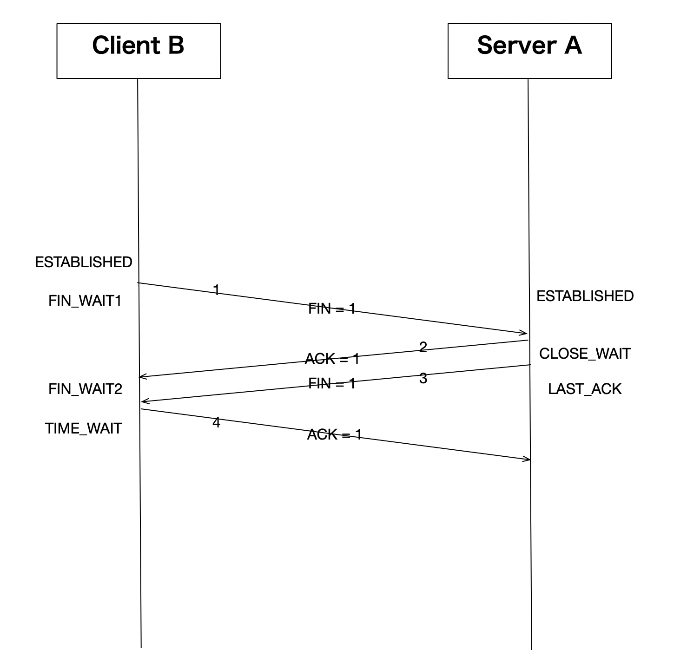
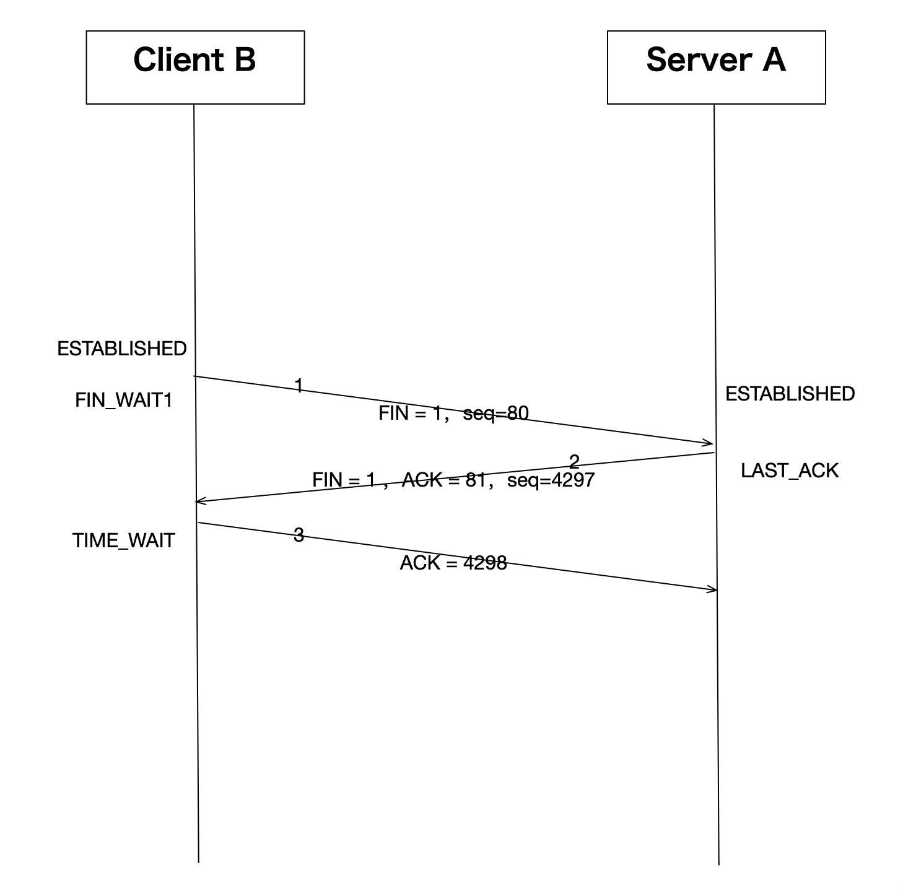

# Linux的TCP实现之：四次挥手

-------------------------------------------------------------------------------------

版权声明：

本文章内容在非商业使用前提下可无需授权任意转载、发布。

转载、发布请务必注明作者和其微博、微信公众号地址，以便读者询问问题和甄误反馈，共同进步。

微博：
[https://weibo.com/orroz/](https://weibo.com/orroz)

博客：
[https://zorrozou.github.io/](https://zorrozou.github.io/)

微信公众号：**Linux系统技术**

-------------------------------------------------------------------------------------

## 前言

本文分析的内核代码基于Linux 5.3。Linux不同版本的TCP代码细节差异还是比较大的，不能面面俱到还请谅解。通过本文你可以了解到：

四次挥手是不是可以变成三次，什么时候会变成三次？

TCP关闭连接的相关状态都有哪些？

如何解决各种状态驻留过多导致的问题？

## 为什么要四次挥手？

这是一个面试时经常会遇到的问题，其实对于一个全双工连接来说，有四次交互关闭连接是一个比较自然的设计。一方确认自己没数据要发了，给对方发fin，对方收到fin之后恢复ack表示确认。另一方也需要一次交互，才能关闭一个双向连接，这个大家应该都可以理解。对于为什么要四次挥手这个问题，可能更值得探讨的是标准的四次挥手中的中间两个包传输是否可以合并？即下图中的2、3两个数据包是不是可以合并？



仅仅从这个标准的四次挥手过程中分析，理论上2、3两个数据包是可以合并的，因为中间似乎没有其他交互需求。但我们必须考虑一个问题，就是TCP协议是给应用服务的。就是说，在server A恢复ack之后，是否给对方发送fin并不是TCP本身决定的，而应该由应用层来决定，毕竟是否还有数据要发给对方是应用决定的。所以，这里一般的设计是，Server A收到fin之后，可以立即发出ack，但是却不能立即发出fin，所以这两个包一般来说不能合并。但这行为在Linux上出现了变化，我们先来看看Linux上的抓包过程：

```
[root@localhost zorro]# tcpdump -i ens33 -nn tcp and port 80 and host 192.168.247.130
tcpdump: verbose output suppressed, use -v or -vv for full protocol decode
listening on ens33, link-type EN10MB (Ethernet), capture size 262144 bytes
11:13:19.912412 IP 192.168.247.130.59252 > 192.168.247.129.80: Flags [S], seq 3077294200, win 64240, options [mss 1460,sackOK,TS val 2964773729 ecr 0,nop,wscale 7], length 0
11:13:19.912483 IP 192.168.247.129.80 > 192.168.247.130.59252: Flags [S.], seq 1618733987, ack 3077294201, win 28960, options [mss 1460,sackOK,TS val 2846616554 ecr 2964773729,nop,wscale 7], length 0
11:13:19.912756 IP 192.168.247.130.59252 > 192.168.247.129.80: Flags [.], ack 1, win 502, options [nop,nop,TS val 2964773729 ecr 2846616554], length 0
11:13:19.912955 IP 192.168.247.130.59252 > 192.168.247.129.80: Flags [P.], seq 1:80, ack 1, win 502, options [nop,nop,TS val 2964773730 ecr 2846616554], length 79: HTTP: GET / HTTP/1.1
11:13:19.912969 IP 192.168.247.129.80 > 192.168.247.130.59252: Flags [.], ack 80, win 227, options [nop,nop,TS val 2846616555 ecr 2964773730], length 0
11:13:19.915686 IP 192.168.247.129.80 > 192.168.247.130.59252: Flags [.], seq 1:2897, ack 80, win 227, options [nop,nop,TS val 2846616558 ecr 2964773730], length 2896: HTTP: HTTP/1.1 200 OK
11:13:19.915981 IP 192.168.247.130.59252 > 192.168.247.129.80: Flags [.], ack 2897, win 496, options [nop,nop,TS val 2964773733 ecr 2846616558], length 0
11:13:19.916176 IP 192.168.247.129.80 > 192.168.247.130.59252: Flags [P.], seq 2897:4297, ack 80, win 227, options [nop,nop,TS val 2846616558 ecr 2964773733], length 1400: HTTP
11:13:19.916359 IP 192.168.247.130.59252 > 192.168.247.129.80: Flags [.], ack 4297, win 501, options [nop,nop,TS val 2964773733 ecr 2846616558], length 0
11:13:19.916628 IP 192.168.247.130.59252 > 192.168.247.129.80: Flags [F.], seq 80, ack 4297, win 501, options [nop,nop,TS val 2964773733 ecr 2846616558], length 0
11:13:19.917503 IP 192.168.247.129.80 > 192.168.247.130.59252: Flags [F.], seq 4297, ack 81, win 227, options [nop,nop,TS val 2846616559 ecr 2964773733], length 0
11:13:19.917676 IP 192.168.247.130.59252 > 192.168.247.129.80: Flags [.], ack 4298, win 501, options [nop,nop,TS val 2964773734 ecr 2846616559], length 0
```

上面是一个完整的http协议交互过程，我们主要关注其连接关闭的过程，用了3个交互包：

```
11:13:19.916628 IP 192.168.247.130.59252 > 192.168.247.129.80: Flags [F.], seq 80, ack 4297, win 501, options [nop,nop,TS val 2964773733 ecr 2846616558], length 0
11:13:19.917503 IP 192.168.247.129.80 > 192.168.247.130.59252: Flags [F.], seq 4297, ack 81, win 227, options [nop,nop,TS val 2846616559 ecr 2964773733], length 0
11:13:19.917676 IP 192.168.247.130.59252 > 192.168.247.129.80: Flags [.], ack 4298, win 501, options [nop,nop,TS val 2964773734 ecr 2846616559], length 0
```

即：



我们发现在这个实际例子中，确实把标准的四次挥手过程中的第2、3个包合并了，简化成了三次挥手。那这里是为什么呢？原因在于，Linux中支持了tcp的延时ack机制改变了这一行为。因为开启了延时ack机制，导致收到第一个fin之后，发送ack的条件不能满足立即发送ack的条件，导致ack的发送被延时了，在延时的过程中，应用如果确认没数据要发，并且也要关闭此连接的情况下，会触发发送fin，这个fin就会和之前的ack合并被发出。

我们再此标记一下内核中以上行为的处理路径，以便有兴趣的人自行研究，内核处理tcp接收数据的入口为tcp_v4_do_rcv()：

```
/* The socket must have it's spinlock held when we get
 * here, unless it is a TCP_LISTEN socket.
 *
 * We have a potential double-lock case here, so even when
 * doing backlog processing we use the BH locking scheme.
 * This is because we cannot sleep with the original spinlock
 * held.
 */
int tcp_v4_do_rcv(struct sock *sk, struct sk_buff *skb)
{
        struct sock *rsk;

        if (sk->sk_state == TCP_ESTABLISHED) { /* Fast path */
                struct dst_entry *dst = sk->sk_rx_dst;

                sock_rps_save_rxhash(sk, skb);
                sk_mark_napi_id(sk, skb);
                if (dst) {
                        if (inet_sk(sk)->rx_dst_ifindex != skb->skb_iif ||
                            !dst->ops->check(dst, 0)) {
                                dst_release(dst);
                                sk->sk_rx_dst = NULL;
                        }
                }
                tcp_rcv_established(sk, skb);
                return 0;
        }

......
        if (tcp_rcv_state_process(sk, skb)) {
                rsk = sk;
                goto reset;
        }
        return 0;
......
}
EXPORT_SYMBOL(tcp_v4_do_rcv);
```

在关闭连接的时候，被动关闭方在接收fin之前一定是TCP_ESTABLISHED状态，所以进入tcp_rcv_established()中处理：

```
void tcp_rcv_established(struct sock *sk, struct sk_buff *skb)
{
        const struct tcphdr *th = (const struct tcphdr *)skb->data;
        struct tcp_sock *tp = tcp_sk(sk);
        unsigned int len = skb->len;

        /* TCP congestion window tracking */
        trace_tcp_probe(sk, skb);

        tcp_mstamp_refresh(tp);
        if (unlikely(!sk->sk_rx_dst))
                inet_csk(sk)->icsk_af_ops->sk_rx_dst_set(sk, skb);
......
step5:
        if (tcp_ack(sk, skb, FLAG_SLOWPATH | FLAG_UPDATE_TS_RECENT) < 0)
                goto discard;

        tcp_rcv_rtt_measure_ts(sk, skb);

        /* Process urgent data. */
        tcp_urg(sk, skb, th);

        /* step 7: process the segment text */
        tcp_data_queue(sk, skb);

        tcp_data_snd_check(sk);
        tcp_ack_snd_check(sk);
        return;

csum_error:
        TCP_INC_STATS(sock_net(sk), TCP_MIB_CSUMERRORS);
        TCP_INC_STATS(sock_net(sk), TCP_MIB_INERRS);

discard:
        tcp_drop(sk, skb);
}
```

在tcp_rcv_established()中，由tcp_data_queue中的逻辑处理fin：

```
void tcp_fin(struct sock *sk)
{
        struct tcp_sock *tp = tcp_sk(sk);

        inet_csk_schedule_ack(sk);
......
							  if (TCP_SKB_CB(skb)->tcp_flags & TCPHDR_FIN)
                        tcp_fin(sk);
......
        if (!sock_flag(sk, SOCK_DEAD)) {
                sk->sk_state_change(sk);

                /* Do not send POLL_HUP for half duplex close. */
                if (sk->sk_shutdown == SHUTDOWN_MASK ||
                    sk->sk_state == TCP_CLOSE)
                        sk_wake_async(sk, SOCK_WAKE_WAITD, POLL_HUP);
                else
                        sk_wake_async(sk, SOCK_WAKE_WAITD, POLL_IN);
        }
}
```

此时会由tcp_fin将连接状态由TCP_ESTABLISHED标记为TCP_CLOSE_WAIT。然后通知用户进程有关闭事件。

然后通过tcp_ack_snd_check()发送ack确认，tcp_ack_snd_check()直接调用__tcp_ack_snd_check()：

```
static void __tcp_ack_snd_check(struct sock *sk, int ofo_possible)
{
        struct tcp_sock *tp = tcp_sk(sk);
        unsigned long rtt, delay;

            /* More than one full frame received... */
        if (((tp->rcv_nxt - tp->rcv_wup) > inet_csk(sk)->icsk_ack.rcv_mss &&
             /* ... and right edge of window advances far enough.
              * (tcp_recvmsg() will send ACK otherwise).
              * If application uses SO_RCVLOWAT, we want send ack now if
              * we have not received enough bytes to satisfy the condition.
              */
            (tp->rcv_nxt - tp->copied_seq < sk->sk_rcvlowat ||
             __tcp_select_window(sk) >= tp->rcv_wnd)) ||
            /* We ACK each frame or... */
            tcp_in_quickack_mode(sk) ||
            /* Protocol state mandates a one-time immediate ACK */
            inet_csk(sk)->icsk_ack.pending & ICSK_ACK_NOW) {
send_now:
                tcp_send_ack(sk);
                return;
        }

        if (!ofo_possible || RB_EMPTY_ROOT(&tp->out_of_order_queue)) {
                tcp_send_delayed_ack(sk);
                return;
        }

        if (!tcp_is_sack(tp) ||
            tp->compressed_ack >= sock_net(sk)->ipv4.sysctl_tcp_comp_sack_nr)
                goto send_now;
......
```

在这个方法中判断是send_now立即发送ack还是通过tcp_send_delayed_ack()延迟发送ack。在上面的正常关闭的例子中，这里条件是触发延迟发送ack的，所以会等到用户接受到关闭事件之后确认没有数据发给对方，也要给对方发送fin关闭连接后，将ack和fin合并发送给对端。这里关于什么时候会触发延迟发送ack，什么时候不触发的问题也值得好好探讨一下，对这里有兴趣的人推荐参考dog250的[这篇文章](https://blog.csdn.net/dog250/article/details/52664508)。

所以，这里关于为什么要四次挥手的正确答案应该是：其实可以不用四次挥手了。在大多数情况下三次挥手也够了。

## TIME WAIT

### TIME_WAIT的等待时间和资源限制

跟关闭连接相关最多最重要的连接状态就是著名的TIME_WAIT状态了，所以我们把它拿到前面来说。相关它的问题包括，为什么要有TIME_WAIT状态？持续多久？答案是：为了实现可靠关闭中的最后一个ack丢失可以接受到重传的fin好方便重传ack。RFC规定要等待两倍的MSL（一个数据分片（报文）在网络中能够生存的最长时间），这个时间也被RFC规定为2分钟。但是实际Linux的实现并不用等这么久，我们先来看看Linux中TIME_WAIT究竟等多久？

为了确认这个问题，我们还是要先来内核中理清楚相关逻辑。首先，TIME_WAIT状态只出现在主动关闭放，即谁调用close谁就进入TIME_WAIT。close关闭的是tcp的话，内核中使用tcp_close()方法进行处理，具体为过程在方法中看TCP_FIN_WAIT2的后续处理：

```
void tcp_close(struct sock *sk, long timeout)
{
        struct sk_buff *skb;
        int data_was_unread = 0;
        int state;

        lock_sock(sk);
        sk->sk_shutdown = SHUTDOWN_MASK;
......
        if (sk->sk_state == TCP_FIN_WAIT2) {
                struct tcp_sock *tp = tcp_sk(sk);
                if (tp->linger2 < 0) {
                        tcp_set_state(sk, TCP_CLOSE);
                        tcp_send_active_reset(sk, GFP_ATOMIC);
                        __NET_INC_STATS(sock_net(sk),
                                        LINUX_MIB_TCPABORTONLINGER);
                } else {
                        const int tmo = tcp_fin_time(sk);

                        if (tmo > TCP_TIMEWAIT_LEN) {
                                inet_csk_reset_keepalive_timer(sk,
                                                tmo - TCP_TIMEWAIT_LEN);
                        } else {
                                tcp_time_wait(sk, TCP_FIN_WAIT2, tmo);
                                goto out;
                        }
                }
        }
......
}
EXPORT_SYMBOL(tcp_close);
```

可以看到正常情况下进入tcp_time_wait()处理，这里检查是否连接是否标记了linger选项，如果标记了则直接reset，未标记还要继续等对端发来fin，所以继续在TCP_FIN_WAIT2状态。当本端收到对端发来的最后一个fin后，将由tcp_v4_do_rcv中的tcp_rcv_state_process处理，其中由tcp_data_queue检查TCP_FIN_WAIT2状态，之后进入tcp_data_queue处理fin头，主逻辑进入tcp_fin()：

```
void tcp_fin(struct sock *sk)
{
        struct tcp_sock *tp = tcp_sk(sk);

        inet_csk_schedule_ack(sk);

        sk->sk_shutdown |= RCV_SHUTDOWN;
        sock_set_flag(sk, SOCK_DONE);

        switch (sk->sk_state) {
......
        case TCP_FIN_WAIT2:
                /* Received a FIN -- send ACK and enter TIME_WAIT. */
                tcp_send_ack(sk);
                tcp_time_wait(sk, TCP_TIME_WAIT, 0);
                break;
......
}
```

然后再由tcp_time_wait将当前tcp状态切换为TCP_TIME_WAIT。 在tcp_time_wait中，由inet_twsk_alloc分配一个管理TCP_TIME_WAIT状态的内存池：

```
struct inet_timewait_sock *inet_twsk_alloc(const struct sock *sk,
                                           struct inet_timewait_death_row *dr,
                                           const int state)
{
        struct inet_timewait_sock *tw;

        if (atomic_read(&dr->tw_count) >= dr->sysctl_max_tw_buckets)
                return NULL;

        tw = kmem_cache_alloc(sk->sk_prot_creator->twsk_prot->twsk_slab,
                              GFP_ATOMIC);
        if (tw) {
                const struct inet_sock *inet = inet_sk(sk);

                tw->tw_dr           = dr;
                /* Give us an identity. */
                tw->tw_daddr        = inet->inet_daddr;
                tw->tw_rcv_saddr    = inet->inet_rcv_saddr;
                tw->tw_bound_dev_if = sk->sk_bound_dev_if;
                tw->tw_tos          = inet->tos;
                tw->tw_num          = inet->inet_num;
                tw->tw_state        = TCP_TIME_WAIT;
                tw->tw_substate     = state;
                tw->tw_sport        = inet->inet_sport;
                tw->tw_dport        = inet->inet_dport;
                tw->tw_family       = sk->sk_family;
                tw->tw_reuse        = sk->sk_reuse;
                tw->tw_reuseport    = sk->sk_reuseport;
                tw->tw_hash         = sk->sk_hash;
                tw->tw_ipv6only     = 0;
                tw->tw_transparent  = inet->transparent;
                tw->tw_prot         = sk->sk_prot_creator;
                atomic64_set(&tw->tw_cookie, atomic64_read(&sk->sk_cookie));
                twsk_net_set(tw, sock_net(sk));
                timer_setup(&tw->tw_timer, tw_timer_handler, TIMER_PINNED);
                /*
                 * Because we use RCU lookups, we should not set tw_refcnt
                 * to a non null value before everything is setup for this
                 * timewait socket.
                 */
                refcount_set(&tw->tw_refcnt, 0);

                __module_get(tw->tw_prot->owner);
        }

        return tw;
}
```

我们可以看到，内存池使用kmem_cache_alloc在slab里分配的，所以如果服务器上TIME_WAIT状态连接很多的话，需要占用较大的slab内存资源，所以这里又个配置可以限制TIME_WAIT的个数上限，即sysctl_max_tw_buckets，这个值可以使用/proc/sys/net/ipv4/tcp_max_tw_buckets文件进行设置。一般服务器上这个值不用设置的过大，以防TIME_WAIT状态过多引发内存过大的占用和系统CPU消耗过多（这里大家可以思考为什么CPU会消耗过多？）。从方法中我们可以看到，在申请完相关资源并设置后，使用timer_setup设置了一个定时器，这个定时器就是为TIME_WAIT实现的等待时间。这个定时器的触发时间是在上一级方法tcp_time_wait中设置的：

```
void tcp_time_wait(struct sock *sk, int state, int timeo)
{
        const struct inet_connection_sock *icsk = inet_csk(sk);
        const struct tcp_sock *tp = tcp_sk(sk);
        struct inet_timewait_sock *tw;
        struct inet_timewait_death_row *tcp_death_row = &sock_net(sk)->ipv4.tcp_death_row;

        tw = inet_twsk_alloc(sk, tcp_death_row, state);

        if (tw) {
                struct tcp_timewait_sock *tcptw = tcp_twsk((struct sock *)tw);
                const int rto = (icsk->icsk_rto << 2) - (icsk->icsk_rto >> 1);
                struct inet_sock *inet = inet_sk(sk);

                tw->tw_transparent      = inet->transparent;
......
                /* Get the TIME_WAIT timeout firing. */
                if (timeo < rto)
                        timeo = rto;

                if (state == TCP_TIME_WAIT)
                        timeo = TCP_TIMEWAIT_LEN;

                /* tw_timer is pinned, so we need to make sure BH are disabled
                 * in following section, otherwise timer handler could run before
                 * we complete the initialization.
                 */
                local_bh_disable();
                inet_twsk_schedule(tw, timeo);
                /* Linkage updates.
                 * Note that access to tw after this point is illegal.
                 */
                inet_twsk_hashdance(tw, sk, &tcp_hashinfo);
                local_bh_enable();
        } else {
                /* Sorry, if we're out of memory, just CLOSE this
                 * socket up.  We've got bigger problems than
                 * non-graceful socket closings.
                 */
                NET_INC_STATS(sock_net(sk), LINUX_MIB_TCPTIMEWAITOVERFLOW);
        }

        tcp_update_metrics(sk);
        tcp_done(sk);
}
```

可以看到，在inet_twsk_alloc中设置好定时器之后，使用TCP_TIMEWAIT_LEN初始化时间，并由inet_twsk_schedule启动定时器。这里相关的知识点是Linux内核中的定时器使用，不明白的可以自行找材料进行知识点学习。我们这里主要关注等待时间是多久，定义为：

```
#define TCP_TIMEWAIT_LEN (60*HZ) /* how long to wait to destroy TIME-WAIT
                                  * state, about 60 seconds     */
```

由此可知，Linux的实现中，TCP_TIME_WAIT等待时间被固定设置为60秒。

### TIME_WAIT是否可以提前回收？

知道了TIME_WAIT要等60秒，那么系统中是否有机制可以让TIME_WAIT被提前回收呢？答案是可以的，我们可以设想一下，如果一个客户端跟服务端建立完连接并正常关闭，如果是服务端主动关闭的话，那么服务端上将会把这个连接设置为TIME_WAIT，如果在TIME_WAIT等待期间，这个客户端又要用相同端口跟服务端建立新连接，此时连接自然应该被接受，当然前提是这确实是个新tcp连接。检查方式就是新来的包是个syn，并且序列号晚于之前连接的最后一个包的seq。此时就应该提前回收这个TIME_WAIT，并重新建立连接。内核代码中处理TCP状态使用TCP_TW_SYN来标记这种情况，大家可以自行跟踪相关代码逻辑来看其处理细节，此处不在复述。

另外Linux支持对TIME_WAIT状态的reuse，更早版本的内核还支持recycle，这两种机制都可以让TIME_WAIT状态被提前回收，我们当前分析的内核版本是Linux 5.3，recycle功能因为会引发比较严重的应用问题，已经在之前的内核版本被移除了，所以我们可以简单分析一下reuse功能。

tcp_tw_reuse功能的描述是：对tcp新建连接打开TIME-WAIT状态的套接字重用。意思就是，如果作为tcp主动连接方，使用connect连接别人的时候，如果没有可用的空闲socket了，可以重用处于TIME-WAIT状态的socket。开关文件是：

/proc/sys/net/ipv4/tcp_tw_reuse

当前版本内核默认值为2。值为0表示关闭此功能，值为1表示打开此功能，值为2表示仅在loopback地址上使用此功能。

既然是仅对主动打开方有效，所以分析其实现的话，主要关注tcp_v4_connect()方法。检查是否有空闲端口或者从tw状态回收的方法是__inet_check_established，调用路径为：tcp_v4_connect -> inet_hash_connect -> __inet_check_established ：

```
/* called with local bh disabled */
static int __inet_check_established(struct inet_timewait_death_row *death_row,
                                    struct sock *sk, __u16 lport,
                                    struct inet_timewait_sock **twp)
{
        struct inet_hashinfo *hinfo = death_row->hashinfo;
        struct inet_sock *inet = inet_sk(sk);
        __be32 daddr = inet->inet_rcv_saddr;
        __be32 saddr = inet->inet_daddr;
        int dif = sk->sk_bound_dev_if;
        struct net *net = sock_net(sk);
        int sdif = l3mdev_master_ifindex_by_index(net, dif);
        INET_ADDR_COOKIE(acookie, saddr, daddr);
        const __portpair ports = INET_COMBINED_PORTS(inet->inet_dport, lport);
        unsigned int hash = inet_ehashfn(net, daddr, lport,
                                         saddr, inet->inet_dport);
        struct inet_ehash_bucket *head = inet_ehash_bucket(hinfo, hash);
        spinlock_t *lock = inet_ehash_lockp(hinfo, hash);
        struct sock *sk2;
        const struct hlist_nulls_node *node;
        struct inet_timewait_sock *tw = NULL;

        spin_lock(lock);
......
        sk_nulls_for_each(sk2, node, &head->chain) {
                if (sk2->sk_hash != hash)
                        continue;

                if (likely(INET_MATCH(sk2, net, acookie,
                                         saddr, daddr, ports, dif, sdif))) {
                        if (sk2->sk_state == TCP_TIME_WAIT) {
                                tw = inet_twsk(sk2);
                                if (twsk_unique(sk, sk2, twp))
                                        break;
                        }
                        goto not_unique;
                }
        }

        /* Must record num and sport now. Otherwise we will see
         * in hash table socket with a funny identity.
         */
        inet->inet_num = lport;
        inet->inet_sport = htons(lport);
        sk->sk_hash = hash;
        WARN_ON(!sk_unhashed(sk));
        __sk_nulls_add_node_rcu(sk, &head->chain);
        if (tw) {
                sk_nulls_del_node_init_rcu((struct sock *)tw);
                __NET_INC_STATS(net, LINUX_MIB_TIMEWAITRECYCLED);
        }
        spin_unlock(lock);
        sock_prot_inuse_add(sock_net(sk), sk->sk_prot, 1);

        if (twp) {
                *twp = tw;
        } else if (tw) {
                /* Silly. Should hash-dance instead... */
                inet_twsk_deschedule_put(tw);
        }
        return 0;

not_unique:
        spin_unlock(lock);
        return -EADDRNOTAVAIL;
}
```

分析代码可以看到，如果没有可用的其他socket，就从tw里面复用。tcp_tw_reuse的开关检查在tcp_twsk_unique方法中，有兴趣的可以自己研究。

老版本内核上还支持的tcp_tw_recycle功能，自从4.10版本之后已经从内核中移除了，本文就不再赘述。不过需要强调的是，tcp_tw_reuse是只针对主动打开侧有效，而tcp_tw_recycle是针对TIME_WAIT的回收功能，并且对主动打开和被动打开都有效。tcp_tw_recycle在很多以集群方式使用的场景下会操成tcp连接异常，所以请慎用。一般来讲，大多数服务器都是Listen状态进入服务，并且主动断开连接的大多数也都是服务端，所以，服务端上比较容易产生大量的TIME_WAIT状态连接的残留。如果它们影响到你的服务器性能的话，第一手段是考虑减少/proc/sys/net/ipv4/tcp_max_tw_buckets。很多人害怕如果不让TIME_WAIT等的时间足够长，会影响连接的质量，其实这种担心没有必要。毕竟，TIME_WAIT状态的存留是为了怕最后一个ack丢失，而导致对端长时间处于LASK_ACK状态，此时对端若重发fin，TIME_WAIT状态就可以响应，再次重发最后一个ack。其实对于正常服务来说，这一步即使真的发生也不会对正常服务造成什么影响，顶多就是让对端处于LASK_ACK的时间比较久而已。而相比服务器端存在大量TIME_WAIT造成的性能影响而言，让一个客户端多在LASK_ACK状态上等待一会也不会造成很大的影响。所以，大家基本可以放心的调小tcp_max_tw_buckets。

另外还有一种激进的消灭TIME_WAIT的方法，就是我们在上面看到的linger标志位。如果对tcp的socket使用setsockopt开启了SO_LINGER选项的话，那么close这个socket时，将从标准的四次挥手关闭连接转为直接发送rst进行关闭。此时将直接越过所有状态，直接关闭连接。这个选项就不在这细说了，大家可以参考手册和相关资料查看细节。

## FIN_WAIT1

主动关闭方发出fin之后会进入到FIN_WAIT1状态，这个状态会持续到对方回复ack为止。一般情况下，这个状态都不会持续太久，大概在一个rtt左右。但是在某些异常情况下，它可能会长时间存在于服务器上。如果出现这种情况，主要原因应该是对端行为异常，要么对端出现bug，要么可能是故意发起的攻击行为。在这种情况下，对应用程序进行重启一般不会缓解现象，因为此时应用程序已经认为TCP连接被关闭，这种TCP连接已经是单纯的内核行为，并不关联任何应用程序。我们把这种应用程序称为tcp orphans（tcp孤儿）。内核维护这种TCP状态需要消耗内存，所以如果这种连接多了会产生针对内存的DoS（拒绝服务）攻击。

内核中有针对这种orphans的最大限制，文件是/proc/sys/net/ipv4/tcp_max_orphans。我们可以用这个文件限制系统可维持的tcp orphans最大个数。超出这个值的新建orphans会被直接reset，并产生内核警告。这个文件的默认值是通过当前系统内存大小计算出来的，所以一般情况我们不用修改这个值。

除了orphans个数上限，FIN_WAIT1的等待时长也会影响其生存周期。那么FIN_WAIT1到底会等多久？这个问题RFC或《TCP/IP详解卷一》都没有描述，似乎完全依赖于具体实现。那么我们就来看看Linux的实现吧：

分析tcp_close()我们并没有发现针对FIN_WAIT1有单独的超时设置，所以这个状态会沿用TCP标准的重传定时器tcp_retransmit_timer()，对于一般的TCP超时重传来说，使用的超时时间定义如下：

```
/**
 *  tcp_retransmit_timer() - The TCP retransmit timeout handler
 *  @sk:  Pointer to the current socket.
 *
 *  This function gets called when the kernel timer for a TCP packet
 *  of this socket expires.
 *
 *  It handles retransmission, timer adjustment and other necesarry measures.
 *
 *  Returns: Nothing (void)
 */
void tcp_retransmit_timer(struct sock *sk)
{
        struct tcp_sock *tp = tcp_sk(sk);
        struct net *net = sock_net(sk);
        struct inet_connection_sock *icsk = inet_csk(sk);
......
        __NET_INC_STATS(sock_net(sk), LINUX_MIB_TCPTIMEOUTS);
        if (tcp_write_timeout(sk))
                goto out;
......
out:;
}
```

其中tcp_write_timeout()方法来设置超时，我们再来看看这个方法：

```
/* A write timeout has occurred. Process the after effects. */
static int tcp_write_timeout(struct sock *sk)
{
        struct inet_connection_sock *icsk = inet_csk(sk);
        struct tcp_sock *tp = tcp_sk(sk);
        struct net *net = sock_net(sk);
        bool expired, do_reset;
        int retry_until;
......
               retry_until = net->ipv4.sysctl_tcp_retries2;
                if (sock_flag(sk, SOCK_DEAD)) {
                        const bool alive = icsk->icsk_rto < TCP_RTO_MAX;

                        retry_until = tcp_orphan_retries(sk, alive);
                        do_reset = alive ||
                                !retransmits_timed_out(sk, retry_until, 0);

                        if (tcp_out_of_resources(sk, do_reset))
                                return 1;
                }
                expired = retransmits_timed_out(sk, retry_until,
                                                icsk->icsk_user_timeout);
        }
......
        if (expired) {
                /* Has it gone just too far? */
                tcp_write_err(sk);
                return 1;
        }

        return 0;
}
```

其中tcp_orphan_retries()决定了重发fin的次数：

```
/**
 *  tcp_orphan_retries() - Returns maximal number of retries on an orphaned socket
 *  @sk:    Pointer to the current socket.
 *  @alive: bool, socket alive state
 */
static int tcp_orphan_retries(struct sock *sk, bool alive)
{
        int retries = sock_net(sk)->ipv4.sysctl_tcp_orphan_retries; /* May be zero. */

        /* We know from an ICMP that something is wrong. */
        if (sk->sk_err_soft && !alive)
                retries = 0;

        /* However, if socket sent something recently, select some safe
         * number of retries. 8 corresponds to >100 seconds with minimal
         * RTO of 200msec. */
        if (retries == 0 && alive)
                retries = 8;
        return retries;
}
```

这里又引申出一个知识点，这里的重试次数是由/proc/sys/net/ipv4/tcp_orphan_retries文件定义的，这个文件默认值为0，而内核里会看，如果使用默认值为0，则实际重试8次。

retransmits_timed_out()决定了间隔时间：

```
static unsigned int tcp_model_timeout(struct sock *sk,
                                      unsigned int boundary,
                                      unsigned int rto_base)
{
        unsigned int linear_backoff_thresh, timeout;

        linear_backoff_thresh = ilog2(TCP_RTO_MAX / rto_base);
        if (boundary <= linear_backoff_thresh)
                timeout = ((2 << boundary) - 1) * rto_base;
        else
                timeout = ((2 << linear_backoff_thresh) - 1) * rto_base +
                        (boundary - linear_backoff_thresh) * TCP_RTO_MAX;
        return jiffies_to_msecs(timeout);
}
/**
 *  retransmits_timed_out() - returns true if this connection has timed out
 *  @sk:       The current socket
 *  @boundary: max number of retransmissions
 *  @timeout:  A custom timeout value.
 *             If set to 0 the default timeout is calculated and used.
 *             Using TCP_RTO_MIN and the number of unsuccessful retransmits.
 *
 * The default "timeout" value this function can calculate and use
 * is equivalent to the timeout of a TCP Connection
 * after "boundary" unsuccessful, exponentially backed-off
 * retransmissions with an initial RTO of TCP_RTO_MIN.
 */
static bool retransmits_timed_out(struct sock *sk,
                                  unsigned int boundary,
                                  unsigned int timeout)
{
        unsigned int start_ts;

        if (!inet_csk(sk)->icsk_retransmits)
                return false;

        start_ts = tcp_sk(sk)->retrans_stamp;
        if (likely(timeout == 0))
                timeout = tcp_model_timeout(sk, boundary, TCP_RTO_MIN);

        return (s32)(tcp_time_stamp(tcp_sk(sk)) - start_ts - timeout) >= 0;
}
```

一般情况下，间隔时间会以TCP_RTO_MIN为单位以2的指数增长，TCP_RTO_MIN在内核中被设置为200ms。每次重试间隔如下：

第一次重试：200 X 2^0 = 200ms

第一次重试：200 X 2^1 = 400ms

第一次重试：200 X 2^2 = 800ms

第一次重试：200 X 2^3 = 1600ms

......以此类推，默认一共重试8次。除非我们改变/proc/sys/net/ipv4/tcp_orphan_retries的设置。所以我们可以通过减小tcp_orphan_retries的值，来影响FIN_WAIT1的等待时间，从而达到在被攻击时的影响效果。

以上只是默认情况下当对端不回ack的时候FIN_WAIT1的等待时间设置。这种情况因为不会收到对端的任何反馈，所以重传总会超时结束。然而还有另外一种情况，可以通过设计一种传输方式，将传输窗口将为0，导致fin发送的时候只缓存到了本地，不能发送给对端，而本端已经进入FIN_WAIT1状态，并且连接只是窗口为0，窗口探测的ack依然持续到来。此时会怎么样呢？

这个问题dog250已经在他的博客上解释的很清楚了，[连接在此](https://blog.csdn.net/dog250/article/details/81697403)。如果需要了解细节的大家可以阅读dog250的博客，我们这里直接上结论：在比较新版本的内核中，上述描述的窗口探测受到tcp_probe_timer的限制，probe的重试次数也被设置成关联tcp_orphan_retries。

## FIN_WAIT2

主动关闭方收到对端回应本端发送的第一个fin的ack包之后，会进入FIN_WAIT2状态，并在此状态等待对端发来的fin，直到接收到fin并回复了ack之后状态再切换为TIME_WAIT。

FIN_WAIT2这个状态相对比较简单，此时本端已经不需要再发送数据，但可能还会接受数据。所以实现上，FIN_WAIT2状态可以等待更长的时间。系统中可以使用/proc/sys/net/ipv4/tcp_fin_timeout来设置一个连接可以维持在FIN_WAIT2状态的超时时间，默认为60秒。FIN_WAIT2状态当然也会受到tcp_max_orphans的限制影响。其实关于FIN_WAIT2值得探讨的问题还很多，比如FIN_WAIT2超时后会不会进入TIME_WAIT状态？相信如果能看懂本文以上所有问题的人已经可以从代码中自己找到答案了。在此继续推荐dog250的博客，相关FIN_WAIT2的文章[连接在此](https://blog.csdn.net/dog250/article/details/81256550)。

## CLOSE_WAIT

正常情况下，被动关闭方接受到对端发来的fin之后，会立即发送ack，并进入CLOSE_WAIT状态。直到确认本端也没数据要发了，给对端发送fin之前，会一直维持这个状态。

大量遗留的CLOSE_WAIT状态是在业务上经常出现的问题，尤其是对于很多自己研发的软件来说尤其是如此。我们可以想像，什么情况下会有大量CLOSE_WAIT状态遗留？那就是tcp通知应用层说对方已经关闭了，你还有数据要发么？而应用层怎么样？压根没反应。所以，一般这种异常都是被动关闭方没有正确处理来自socket的事件而产生的问题。遇到这种问题是，请检查代码bug。

## LAST_ACK

当被动关闭方发出要跟对方关闭连接的fin之后，本端会进入LAST_ACK状态，并持续到对端发来ack为止。那么如果对方没有发来ack，本端的LAST_ACK要持续多久呢？我们来观察一下，抓包为：

```
13:39:10.346386 IP 192.168.247.129.80 > 192.168.247.130.60106: Flags [F.], seq 1, ack 2, win 227, options [nop,nop,TS val 2941767187 ecr 3059924160], length 0
13:39:10.553797 IP 192.168.247.129.80 > 192.168.247.130.60106: Flags [F.], seq 1, ack 2, win 227, options [nop,nop,TS val 2941767394 ecr 3059924160], length 0
13:39:10.762679 IP 192.168.247.129.80 > 192.168.247.130.60106: Flags [F.], seq 1, ack 2, win 227, options [nop,nop,TS val 2941767603 ecr 3059924160], length 0
13:39:11.170077 IP 192.168.247.129.80 > 192.168.247.130.60106: Flags [F.], seq 1, ack 2, win 227, options [nop,nop,TS val 2941768010 ecr 3059924160], length 0
13:39:11.977960 IP 192.168.247.129.80 > 192.168.247.130.60106: Flags [F.], seq 1, ack 2, win 227, options [nop,nop,TS val 2941768818 ecr 3059924160], length 0
13:39:13.643544 IP 192.168.247.129.80 > 192.168.247.130.60106: Flags [F.], seq 1, ack 2, win 227, options [nop,nop,TS val 2941770484 ecr 3059924160], length 0
13:39:16.907479 IP 192.168.247.129.80 > 192.168.247.130.60106: Flags [F.], seq 1, ack 2, win 227, options [nop,nop,TS val 2941773748 ecr 3059924160], length 0
13:39:23.691004 IP 192.168.247.129.80 > 192.168.247.130.60106: Flags [F.], seq 1, ack 2, win 227, options [nop,nop,TS val 2941780531 ecr 3059924160], length 0
13:39:37.001932 IP 192.168.247.129.80 > 192.168.247.130.60106: Flags [F.], seq 1, ack 2, win 227, options [nop,nop,TS val 2941793842 ecr 3059924160], length 0
13:40:03.113640 IP 192.168.247.129.80 > 192.168.247.130.60106: Flags [F.], seq 1, ack 2, win 227, options [nop,nop,TS val 2941819954 ecr 3059924160], length 0
```

实际上这里依然收到TCP重传定时器和超时的影响，被RTO和tcp_orphan_retries限制。当重传次数超限后，会关闭连接。

## 最后

如果幸运的话，TCP关闭连接的这些状态除了TIME_WAIT外，其他状态基本都应该是转瞬既逝的。当然，如果服务器上任何一种状态驻留时间过长、累积量过大都会对系统性能造成影响，最严重的结果就是耗尽内存或者四元组空间，导致拒接服务。

在本篇的最后我要特别感谢我的前同事dog250——赵亚同学。虽然我没机会当面跟你请教，但是你博客的文章无疑在我学习Linux网络相关知识的过程中给了我很大帮助，大大缩短了我学习代码的时间并给了我不少启发。在此特别感谢！希望可以有机会一起喝酒吹牛。

----------------------------------

大家好，我是Zorro！

如果你喜欢本文，欢迎在微博上搜索“**orroz**”关注我，地址是：
[https://weibo.com/orroz](https://weibo.com/orroz)

大家也可以在微信上搜索：**Linux系统技术** 关注我的公众号。

我的所有文章都会沉淀在我的个人博客上，地址是：
[https://zorrozou.github.io/](https://zorrozou.github.io/)。

欢迎使用以上各种方式一起探讨学习，共同进步。

公众号二维码：


----------------------------------

