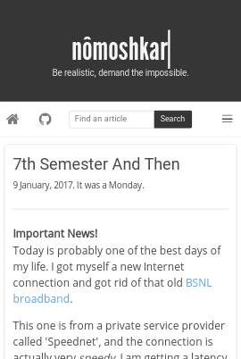
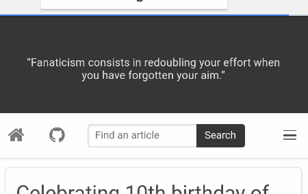
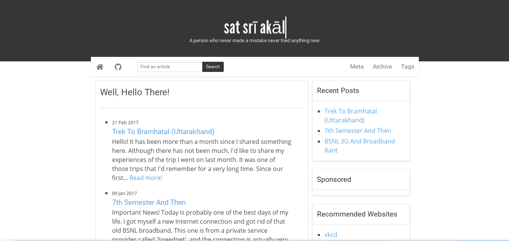
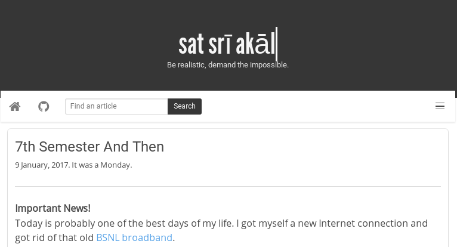
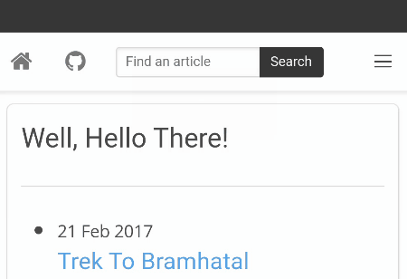
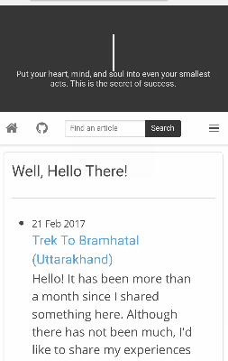

# Soot Spirits Jekyll Theme

Soot Spirits is a responsive mobile ready lightweight two column Jekyll theme made with Bulma CSS. It is a great template for simple personal blogs with focus on typography.



The text is made beautiful with combination of [League Gothic](https://www.fontsquirrel.com/fonts/league-gothic), [Roboto](https://fonts.google.com/specimen/Roboto) and [Open Sans](https://fonts.google.com/specimen/Open+Sans). Now who doesn't love them.



### Demo
[sootspirits.github.io](https://sootspirits.github.io)

### Some Good Features

- Fully mobile ready
- Beautiful typography
- Two column layout suitable for a wide range of blogging habits
- Fully customisable theme including the 'hello' text, quotes, nav items and sidebar widgets

### Screenshots
##### Deskop browser (full width)


##### Tablet browser (iPad)


##### Mobile browser (320px and greater)


##### Hamburger menu toggle


##### Basic navigation and footer


### Theme Usage

- [Get started](https://jekyllrb.com/docs/installation/) with having the necessary tools set up
- Download the zip of this project or simple clone it
- Delete the ```tmp/``` directory and any sample ```_posts```
- Customize the variables in ```_config.yml``` file such that it reflects your information. Similarly, change the disqus username (or remove it altogether).
- Replace footer links in the ```_layouts/default.html``` file with yours.
- Replace the ```site:example.com``` in ```assets/js/custom.js``` with your site's address.

### Credits
- [Codepen hi-im-si](http://codepen.io/hi-im-si/pen/DHoup) for the header 'hello' typewriter text
- [Bulma CSS](bulma.io/)
- [Jekyll](https://jekyllrb.com)
- [Github](https://github.com)

### Licence
MIT


### What's up with the name?
I was watching [My Neighbour Totoro](https://en.wikipedia.org/wiki/Susuwatari) while developing :-)
